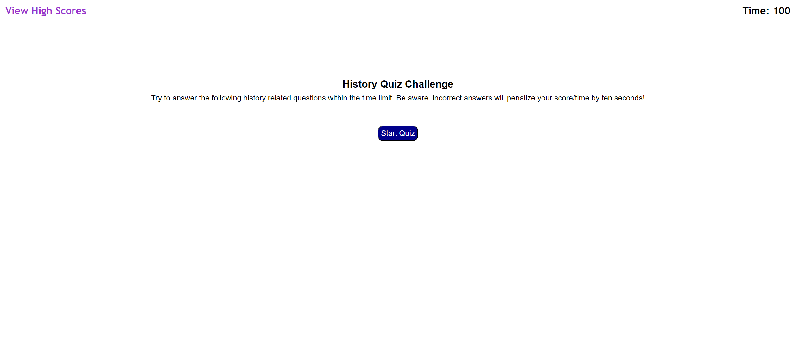

# Mod 4 History Quiz

## Description

This is an interactive quiz.  Most of the questions are from different regions so this quiz will surely test the user's historical knowledge!

https://bpoole53.github.io/Mod-4-Quiz/

## Installation

N/A

## Usage

There are 5 questions.  The user must click on a response to each question and they will be notified if they are correct or not.  If there is time remaining at the end the user will be prompted to enter their initials to be added to the high score list.  If they run out of time they will not be given that option, and can choose to try again or view the high scores.  From the high score screen they can clear the high score list.

## Credits

N/A

## License

N/A
